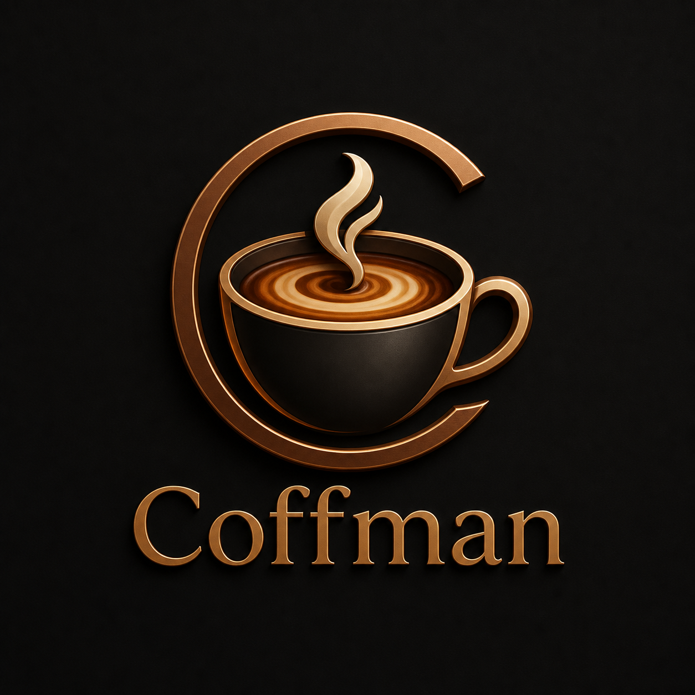

<div align="center">
  

  # Coffman

  **Темный 3D/WebGL лендинг для кофейни с меню, scroll-анимациями и атмосферной визуальной подачей.**

  [](https://react.dev/)
  [](https://www.typescriptlang.org/)
  [](https://vite.dev/)
  [](https://threejs.org/)
</div>

## Preview

**Live:** https://sodex00.github.io/Coffman/

## О проекте

Coffman - это промо-лендинг кофейни в темных тонах. Главный экран построен вокруг WebGL-сцены с 3D-чашкой кофе, а остальные блоки раскрывают меню, атмосферу заведения и контакты.

## Что внутри

- 3D/WebGL сцена на Three.js
- React + TypeScript + Vite
- Темный премиальный UI с медными акцентами
- Анимации появления элементов при скролле
- Меню кофейни с напитками, ценами и десертами
- Адаптивная верстка для desktop и mobile
- Сгенерированный логотип Coffman
- Настроенный `base` для GitHub Pages

## Стек

| Технология | Для чего |
| --- | --- |
| React | Компонентный интерфейс |
| TypeScript | Типизация и надежность кода |
| Vite | Быстрый dev-server и production build |
| Three.js | 3D/WebGL сцена |
| Lucide React | Иконки интерфейса |
| CSS | Адаптив, анимации, темная визуальная система |

## Запуск

```bash
npm install
npm run dev
```

## Сборка

```bash
npm run build
```

## Структура

```text
src/
  assets/
    brand/
      coffman-logo.png
  App.tsx
  App.css
  index.css
```

## Автор

**SodeX**

- GitHub: [Sodex00](https://github.com/Sodex00)
- Portfolio style: dark, animated, modern frontend
